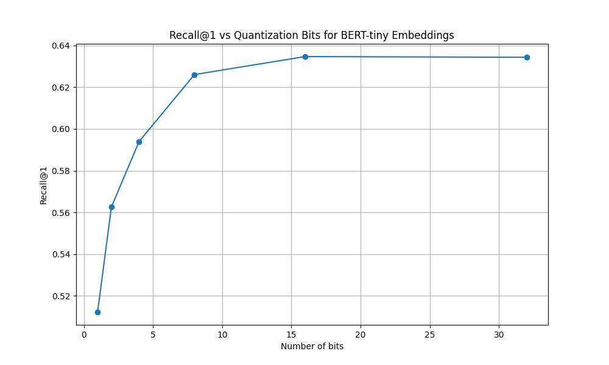

# Exa-ML Interview

## Overview

* Used 10% of data for training, 1000 queries for val set during training
    * Still not convinced I created this very efficiently; if I'd run the dataset creation for the whole thing it would have taken over 4 hours to create (due largely to the index, not tokenisation or anything)
    * I think this is due to the way the specific marco dataset is structured in this particular HF repo; I would have liked to use the Microsoft one because you don't have to index in from different splits and I could have grabbed everything at once without filtering (although again, there might be a better way to do this that I'm missing)
* Trained a bi-encoder with `bert-large-uncased` as the basis for the model. I know Will/Michael said to use `bert-large`, but in retrospect should have used `bert-tiny` since I was only here for half a day. Would have allowed me to iterate faster.
    * Slowed me down during training (although this was more bottlenecked by creating the data index in the first place, as discussed above)
    * The main place it slowed me down was in creating embeddings; I played around with a lot of different batch sizes but even with an A100 it took over 2.5 hours to create embeddings for the whole corpus for my test set that I compared to other methods (e.g. TF-IDF)
    * I've uploaded my trained model to huggingface at `charlieoneill/exa-int` (it's called `biencoder_model.pth`)
* Originally trained using four sampled hard negative documents, but as per Michael's suggestion swapped to use the positive documents of the other samples in the batch as negatives
    * This basically ends up with a CLIP-style loss where you want your similarity matrix to be 1 on the diagonal and 0 elsewhere
    * With a batchsize of 32, I ended up getting around 0.9 recall@1 on the training set, and 0.82-0.85 recall@1 on the validation set of 1000 queries I took from the dev set (JSONs of loss curves attached)
* I used 100 queries from 1% of the corpora to evaluate a few approaches; again, this was a bit hard without the embeddings, but:
    * Showed that TF-IDF with stopwords removed only gets ~0.5 recall@1

Recall@1 on dev set during training (batch size 32 = 31 negatives per positive, and this plot starts at epoch 2 because I restarted it):

Training loss and dev loss (again starting at epoch 2):

Table of TF-IDF, BM25, base BERT lookup (on a very small subset of the data, 100000 documents, 2500 queries):

| Method | Recall@1 | Recall@3 | Recall@10 |
| --- | --- | --- | --- |
| TF-IDF | 0.5048 | 0.6911 | 0.8133 |
| BM25 | 0.4628 | 0.6230 | 0.7155 |
| BERT | 0.6350 | 0.8189 | 0.9107 |

Weirdly, TF-IDF does better than BM25, but I'm chalking this up to the size of the data.

Other stuff I'd want to try for training:
* Use T5 cross-encoder for knowledge distillation to teach the bi-encoder to be better at distinguishing between similar documents (seems like this works based on the literature)

## Extensions

Whilst it was difficult to add extensions without the actual embeddings themselves, here's what I would have done once I figured out recall@1 on the validation set with the trained bi-encoder.

If recall@1 was low:
* Train with more than 10% of the data (this wasn't that long to train, so I probably would have just swapped to Microsoft's dataset structure, indexed it properly and more efficiently, and trained on the whole thing)
* Hard negative mining to improve ability to distinguish between similar documents. Maybe with TF-IDF index, in addition to the bi-encoder getting the negative samples randomly from other samples in the batch, I could have also gotten the top 10 most similar documents from the TF-IDF index (as in similar to the positive doc in that batch) and used those as negatives
* Use `gpt-4o-mini` to generate similar queries and documents; maybe could exploit this for hard negative mining
* Maybe played around with training a cross-encoder on the final day
* I know the requirement is less than a second, but I think using a really small model like haiku or gpt-4o-mini to do HYDE to rewrite the query would improve performance significanlty, particularly if I could implement the latency improvements below

If time was a problem (e.g. over 1s per query, which I think is more likely than recall@1 being low):
* Cluster nearest neighbours of embedding over the corpora, store the centroids, and then use these as basis for search. With 14 million embeddings in this dataset, I'd probably go for around 10,000 centroids, do the initial vector-matrix semantic search (between query and centroids "documents") with these, and then keep the top 100 centroids and do the full search with the embeddings in those clusters.
* Quantise the embeddings to binary, do an initial search with this (in fact I think there's some way you can convert this to basically a lookup table with your query and hamming distance, but I'm not sure), keep the top 10000 or even 100,000, and then do the full search.
* I'd probably have a look at the interplay between the above two methods - I could imagine a curve where you visualise a combination of quantisation and clustering (e.g. num bits for quantising on the x-axis, num_clusters on the y-axis, and then colour for recall@1) and figure out some nice tradeoff curves and where you want to be sitting.
* I'd also look at them varying separately - for instance with clustering, how does recall@1 change if you change the number of clusters, but also the number of top-k clusters you keep to do the full semantic search within? Similarly, for quantisation, how does recall@1 change if you change the number of bits you quantise to, but also the number of top-k quantised documents you then do the unquantised search with?
* I would say use a keyword search to rule out some documents initially as well with TF-IDF, but (1) I don't think this actually does that much to reduce latency (because although you're doing a sparse vector-matrix multiply it's still a vector matrix multiply) and (2) the TF-IDF didn't fare very well here anyway. 
* On a less confident note, I know that cosine similarity between a vector and all the vectors in the document matrix is not the most efficient way to do this lookup. For instance, I know FAISS nearest neighbour search is faster, but I couldn't tell you why. (Addendum: a quick google search tells me that this is for reasons similar to clustering search and quantisation anyway.)

I tried some of this with BERT embeddings over our small subset of the data. For instance, how does performance change with the level of quantisation?

Also, how does performance change with changing how many top-n we get with 1-bit quantisation lookup, followed by "reranking" by full search with those top n?

And I did some clustering stuff as well - using k centroids to search, then searching the top n centroids with the full embeddings:

I'm not sure if I'm mistaken here or not. I guess if you have more centroids you're more likely to maybe miss the one the thing is in, so a lower number of centroids just makes you more likely to grab the actual one. But then if you have too few you're not going to get the right one. I guess this is why you'd want to do some kind of tradeoff curve.